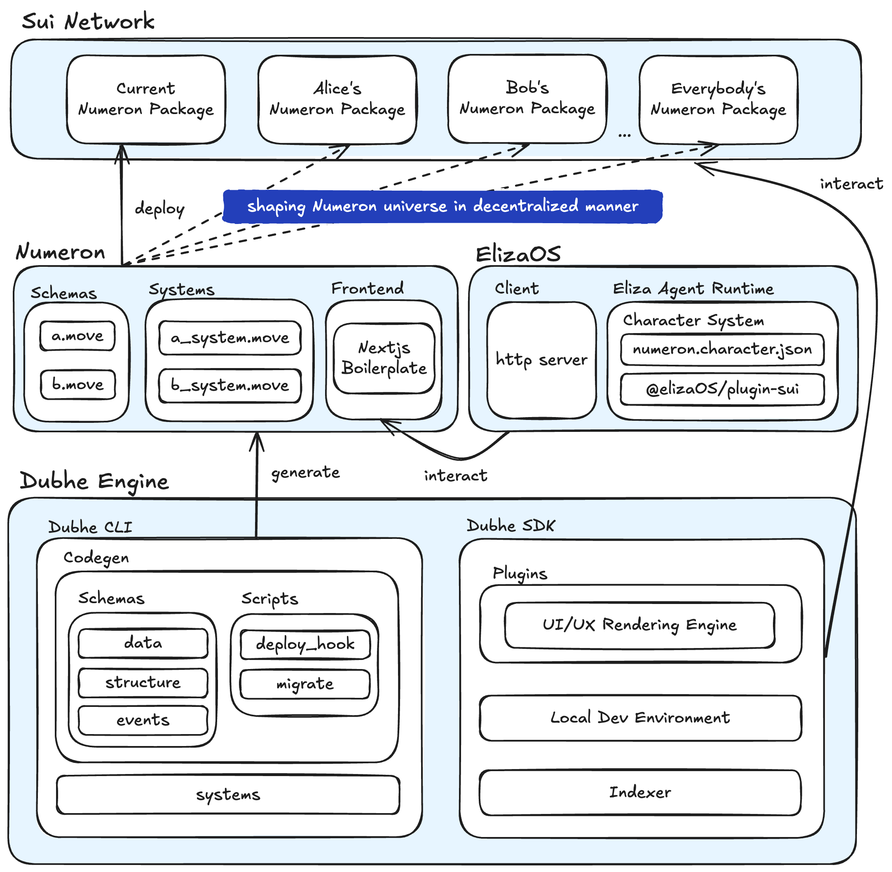

# Numeron

Numeron, an on-chain world built with [Dubhe Engine](https://github.com/0xobelisk/dubhe) on Sui Network, incorporates ElizaOS to create a genuine, intelligent, and interesting NPC system.

## Project Structure

- [AI](./eliza-config) Chain thinker with ElizaOS AI
- [Contracts](./contracts) Move Based Build Wiht Dubhe Engine Toolchains
- [Numeron Code](./src) User Client Interface

<p align="center">
 
    <br>
    <em>Architecture of Numeron</em>
</p>

## Quick Start

### Start Eliza

```bash
git clone https://github.com/elizaos/eliza.git

cd eliza

pnpm install --no-frozen-lockfile

pnpm run build

write .env file (set sui private key and AI model key)

pnpm run start --character=eliza-config/numeron.character.json

pnpm start:client
```

### Start Numeron Project

```bash
1. install sui <https://docs.sui.io/build/install>

2. cd Numeron/

3. pnpm install

4. open new window && pnpm start:localnet

5. open new window && pnpm dev
```

Environment: node.js (v18.20.0+) ([download](https://nodejs.org/en/download/))

> Please use `node -v` check your node version

Deploy it to the cloud with [Vercel](https://vercel.com/new?utm_source=github&utm_medium=readme&utm_campaign=next-example) ([Documentation](https://nextjs.org/docs/deployment)).


## Prerequisites

- [Dubhe Engine](https://dubhe.obelisk.build/dubhe)
- Nextjs

